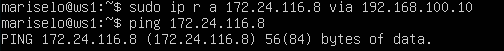
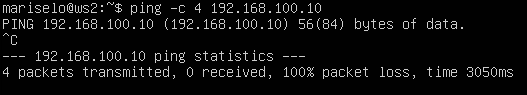
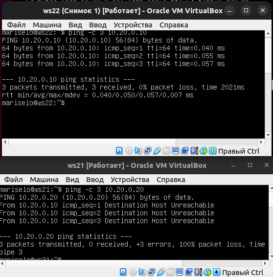
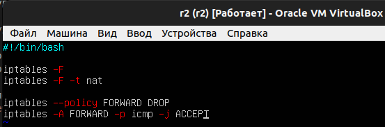
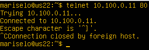
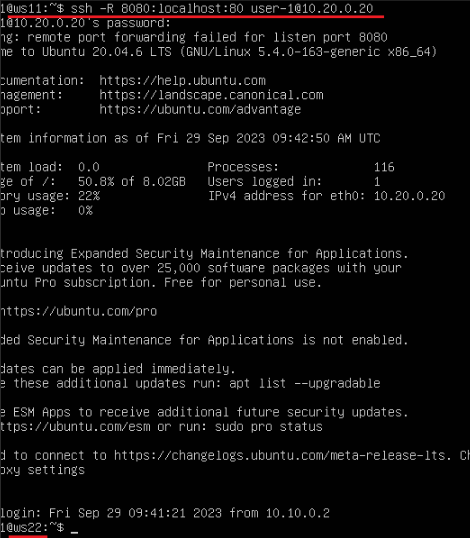

# Сети в Linux

 
## Part 1. Инструмент ipcalc

Поднять виртуальную машину (далее -- ws1)

### 1.1. Сети и маски

Определить и записать в отчёт:

1.1.1 адрес сети 192.167.38.54/13

1.1.2 перевод маски 255.255.255.0 в префиксную и двоичную запись, /15 в обычную и двоичную, 11111111.11111111.11111111.11110000 в обычную и префиксную

1.1.3 минимальный и максимальный хост в сети 12.167.38.4 при масках: 
 /8, 11111111.11111111.00000000.00000000, 255.255.254.0, /4

### 1.2. localhost

Определить и записать в отчёт, можно ли обратиться к приложению, работающему на localhost, со следующими IP: 194.34.23.100, 127.0.0.2, 127.1.0.1, 128.0.0.1

Ответ: к локальным ip-адресам принадлежат все ip с 127.0.02 до 127.1.0.1
Следовательно к локальным ip относятся только 127.0.0.2 и 127.1.0.1

### 1.3. Диапазоны и сегменты сетей

1.3.1 какие из перечисленных IP можно использовать в качестве публичного, а какие только в качестве частных: 10.0.0.45, 134.43.0.2, 192.168.4.2, 172.20.250.4, 172.0.2.1, 192.172.0.1, 172.68.0.2, 172.16.255.255, 10.10.10.10, 192.169.168.1

Ответ: Приватные адреса начинаются со следующих чисел -10, 127, 169, 172, 192. Все остальные IP относятся к публичным.

Приватные: 10.0.0.45 , 172.20.250.4, 172.0.2.1, 192.172.0.1, 172.68.0.2, 172.16.255.255, 10.10.10.10, 192.169.168.1
Публичный: 134.43.0.2

 
## Part 2. Статическая маршрутизация между двумя машинами

2.0.1 Поднять две виртуальные машины (далее -- ws1 и ws2)

2.0.2 С помощью команды ip a посмотреть существующие сетевые интерфейсы
ws1

ws2

2.0.3 Описать сетевой интерфейс, соответствующий внутренней сети, на обеих машинах и задать следующие адреса и маски: ws1 - 192.168.100.10, маска /16, ws2 - 172.24.116.8, маска /12

В отчёт поместить скрины с содержанием изменённого файла etc/netplan/00-installer-config.yaml для каждой машины.

ws1

ws2

2.0.4 Выполнить команду netplan apply для перезапуска сервиса сети

ws1

ws2

### 2.1. Добавление статического маршрута вручную

Добавить статический маршрут от одной машины до другой и обратно при помощи команды вида ip r add

задал маршрут на ws1

комманда для того, чтобы видел принятие сигнала на ws2

Пропинговать соединение между машинами

________________________________
соединение от ws1 до ws2

Теперь в другую сторону

сейчас они оба принимают сигналы, но не отвечают друг-другу

### 2.2. Добавление статического маршрута с сохранением

Перезапустить машины

Добавить статический маршрут от одной машины до другой с помощью файла etc/netplan/00-installer-config.yaml

В отчёт поместить скрин с содержанием изменённого файла etc/netplan/00-installer-config.yaml.

ws1

ws2

Пропинговать соединение между машинами

ws1

ws2

 
## Part 3. Утилита iperf3

В данном задании используются виртуальные машины ws1 и ws2 из Части 2

### 3.1. Скорость соединения

Перевести и записать в отчёт: 8 Mbps в MB/s, 100 MB/s в Kbps, 1 Gbps в Mbps

Выполнил как я понял задание. Если что буду рад комментариям.

### 3.2. Утилита iperf3

Измерить скорость соединения между ws1 и ws2

 
## Part 4. Сетевой экран
- После соединения машин, перед нами стоит следующая задача: контролировать информацию, проходящую по соединению. Для этого используются сетевые экраны.
== Задание ==
В данном задании используются виртуальные машины ws1 и ws2 из Части 2

### 4.1. Утилита iptables

Создать файл /etc/firewall.sh, имитирующий фаерволл, на ws1 и ws2:

Нужно добавить в файл подряд следующие правила:

1. на ws1 применить стратегию когда в начале пишется запрещающее правило, а в конце пишется разрешающее правило (это касается пунктов 4 и 5)

2. на ws2 применить стратегию когда в начале пишется разрешающее правило, а в конце пишется запрещающее правило (это касается пунктов 4 и 5)

3. открыть на машинах доступ для порта 22 (ssh) и порта 80 (http)

4. запретить echo reply (машина не должна "пинговаться”, т.е. должна быть блокировка на OUTPUT)

5. разрешить echo reply (машина должна "пинговаться")

iptables — это утилита брандмауэра командной строки, которая использует цепочки политик для разрешения или блокировки трафика.
Когда соединение пытается установиться в вашей системе, iptables ищет в своем списке правило, которому оно соответствует.
Если он его не находит, он прибегает к действию по умолчанию. В фильтре iptables все пакеты делятся на 5 видов цепочек:

- PREROUTING — предназначена для первичной обработки входящих пакетов, адресованных как непосредственно серверу, так и другим узлам сети. Сюда попадает абсолютно весь входящий трафик для дальнейшего анализа.

- INPUT — для входящих пакетов, отправленных непосредственно этому серверу.

- FORWARD — для проходящих пакетов, не адресованных этому компьютеру, предназначены для передачи следующему узлу, в случае, если сервер выполняет роль маршрутизатора.

- OUTPUT — для пакетов, отправленных с этого сервера.

- POSTROUTING — здесь оказываются пакеты, предназначенные для передачи на другие узлы сети.

Для каждого типа пакетов можно установить набор правил, которые по очереди будут проверяться на соответствие с пакетом и если пакет соответствует, то применять к нему указанное в правиле действие. Правила образуют цепочку, поэтому input, output и forward называют цепочками, цепочками правил. Действий может быть несколько:

- ACCEPT - разрешить прохождение пакета дальше по цепочке правил;

- DROP - удалить пакет;

- REJECT - отклонить пакет, отправителю будет отправлено сообщение, что пакет был отклонен;

- LOG - сделать запись о пакете в лог файл;

- QUEUE - отправить пакет пользовательскому приложению.

В netfilter существуют 5 типов таблиц, каждая из них имеет свое назначение. Имена таблиц принято писать строчными буквами.

- raw - Содержит цепочки PREROUTING и OUTPUT, здесь производятся манипуляции с пакетами до задействования механизма определения состояний.

- mangle - Предназначена для модификации заголовков сетевых пакетов, таких параметров как ToS (Type of Service), TTL (Time To Live), MARK. Содержит все существующие пять цепочек.

- nat - Используется для трансляции сетевых адресов, т.е. подмены адреса получателя/отправителя, применяется, если сервер используется в качестве маршрутизатора. Содержит цепочки PREROUTING, OUTPUT, POSTROUTING.

- filter - Основная таблица, служит для фильтрации пакетов, именно здесь происходит принятие решений о разрешении или запрете дальнейшего движения пакета в системе. Используется по умолчанию, если явно не указано имя другой таблицы. Содержит цепочки INPUT, FORWARD и OUTPUT.

- security - Используется для взаимодействия с внешними системами безопасности, в частности с SELinux и AppArmor. Содержит цепочки INPUT, OUTPUT и FORWARD.

Устнавливаем утилиту командой `sudo apt install iptables`.

Создаём файл `/etc/firewall.sh`, имитирующий фаерволл, на ws1 и ws2 и редактируем по заданию:

В отчёт поместить скрины с содержанием файла /etc/firewall для каждой машины.

Команда -F (-flush) удаляет все правила, команда -X (-delete-chain) удаляет пользовательскую цепочку, команда -A (-append) добавляет правило в конец указанной цепочки, -p указывет используемый протокол (tcp или icmp), -j означает, когда правило подошло — выполнить указанное действие. --dport - порт для получения пакетов, --sport - порт для отправки пакетов. Эхо-запросы (Echo Request) и эхо-ответы (Echo Reply) применяются для проверки активности системы. 

Запускаем файлы на обеих машинах командами `chmod +x /etc/firewall.sh` (chmod +x дает права на выполнение) и `/etc/firewall.sh`:

Разница между стратегиями, применёнными в первом и втором файлах заключается в порядке команд, если в начале идет запрещающее правило, то далее оно не перезаписывается разрешающим правилом, получаем, что ws1 отклоняет пакеты, а ws2 разрешает им проходить.

### 4.2 Утилита nmap

Пингуем наши машины:

Не пингуется ws1. Утилитой nmap проверяем, запущен ли хост машины:

Примечание: у меня долгое время были закрыты порты 80 и 22
Для их открытия я установил ПО для ssh и htpp сервера.

Сохраняем дампы образов виртуальных машин:
Дампы - это:
Образ виртуальной машины (VM image) представляет собой файл или набор файлов, который содержит в себе всю информацию, необходимую для создания и запуска виртуальной машины (VM). Этот образ обычно включает в себя операционную систему, установленное программное обеспечение, конфигурационные данные и все другие компоненты, необходимые для функционирования виртуальной машины.

Образ виртуальной машины может быть использован для развертывания одной или нескольких идентичных копий виртуальной машины на хостовой системе или виртуальном окружении. Он является основой для создания виртуальных машин и упрощает процесс установки и конфигурации операционных систем и приложений, так как весь необходимый софт и настройки уже включены в образ.

- Включаем отображение "снимков" в VirtualBox:

- Сохраняем дамп и задаем ему имя:

- Аналогично для ws2, путь к дампу указан внизу в свойствах:

 
## Part 5. Статическая маршрутизация сети
Поднимаем пять виртуальных машин (3 рабочие станции (ws11, ws21, ws22) и 2 роутера (r1, r2), для изменения названий машин использовалась команда `sudo hostnamectl set-hostname <новое_имя>`, также в VirtualBox указано нужное количество сетевых адаптеров на каждой машине). 

Схема сети:

### 5.1. Настройка адресов машин

Необходимо настроить конфигурации машин в etc/netplan/00-installer-config.yaml согласно сети на рисунке.

Для начала необходимо переименовать сетевые интерфейсы согласно схеме, для этого понадобиться MAC-адрес сетевого ада:птера, его можно узнать через VirtualBox, либо командой `sudo ifconfig -a`

enp0s3

после в файле `etc/netplan/00-installer-config.yaml` указать новое название для всех ws eth0 и мак-адрес.

пример замены конфига: 

Результат замены:

Также можно использовать команду `ip link show` для сокращенного варианта

скрины конфигов для ws.

В настройках машины везде ставим "внутренняя сеть" и добавляем еще один адаптер(сетевой интерфейс).

Mein macaddresses:

ws11: 08:00:27:f8:6b:e0

ws21: 08002746A9F2

ws22: 08:00:27:af:da:bc

r1 A1(to network1): 08:00:27:dd:24:c6

r1 A2(to network2):080027713697

r2 A1(to network2): 0800271E1C18

r2 A2(to network3): 080027ABE421

Не забываем на всех машинах применить команду `sudo netplan apply`.

Проверяем изменения командой `ip -4 a` (-4 то же, что и -f inet, выбирает протокол, a - показывает адреса).

Скрины этой команды прилогать не буду тк, если адреса вписаны не верно, то пинг не пройдет. Пингуем.

Для проверки пингуем ws21 c ws22:

### 5.2. Включение переадресации IP-адресов.

Для включения переадресации IP на роутерах выполним команду `sysctl -w net.ipv4.ip_forward=1`:

При таком подходе переадресация не будет работать после перезагрузки системы. Тогда откроем файл `/etc/sysctl.conf` и добавим в него следующую строку: `net.ipv4.ip_forward = 1`. При использовании этого подхода, IP-переадресация включена на постоянной основе.

Файл `/etc/sysctl.conf` на r1:

### 5.3. Установка маршрута по-умолчанию

Настроить маршрут по-умолчанию (шлюз) для рабочих станций можно добавив в yaml-файл строку `gateway4: <address>`, однако такой способ считается устраевшим, используем другой вариант(`routes`), указанный на скриншотах.

Файл `etc/netplan/00-installer-config.yaml` на ws11:

Файл `etc/netplan/00-installer-config.yaml` на ws 21:

Файл `etc/netplan/00-installer-config.yaml` на ws 22:

После на всех рабочих станциях вызываем `netply apply` и `ip r`, чтобы показать, что добавился маршрут в таблицу маршрутизации:

Далее для пингуем с ws11 роутер r2:

На самом деле на r2 что пинг доходит (подробнее в пункте 5.4), убеждаемся в этом, используя команду `tcpdump -tn -i eth0` :

### 5.4. Добавление статических маршрутов

Необходимо добавить в роутеры r1 и r2 статические маршруты в файле конфигураций.

Файл `etc/netplan/00-installer-config.yaml` на r1:

Файл `etc/netplan/00-installer-config.yaml` на r2:

Вызываем `netplan apply` и `ip r`, чтобы показать таблицы с маршрутами на обоих роутерах:

Далее на ws11 запускаем команды `ip r list 10.10.0.0/[маска сети]` и `ip r list 0.0.0.0/0` :

Lля адреса 10.10.0.0/[маска сети] был выбран маршрут, отличный от 0.0.0.0/0, хотя он попадает под маршрут по-умолчанию, потому что адрес 0.0.0.0/0 «без конкретного адреса назначения», т.е он соответствует любому адресу.

Проще говоря, IP-адрес 0.0.0.0 означает "эта сеть", но он не является полезным адресом в традиционном смысле. Он немного похож на записку, в которой говорится: "Вставьте адрес здесь" или, в зависимости от контекста, "нет конкретного адреса назначения". Он действует как запасной вариант до тех пор, пока не будет назначен действительный, маршрутизируемый IP-адрес.

### 5.5. Построение списка маршрутизаторов

Запускаем на r1 команду `tcpdump -tnv -i eth0`. При помощи утилиты `traceroute` нужно построить список маршрутизаторов на пути от ws11 до ws21, вводим комнаду `traceroute <IP ws21>`:

Вывод команды `tcpdump -tnv -i eth0` на r1 после выше сделнного действия:

Принцип работы построения пути при помощи traceroute:

Каждый пакет проходит на своем пути определенное количество узлов, пока достигнет своей цели. Причем, каждый пакет имеет свое время жизни. Это количество узлов, которые может пройти пакет перед тем, как он будет уничтожен. Этот параметр записывается в заголовке TTL, каждый маршрутизатор, через который будет проходить пакет уменьшает его на единицу. При TTL=0 пакет уничтожается, а отправителю отсылается сообщение Time Exceeded.

Команда traceroute linux использует UDP пакеты. Она отправляет пакет с TTL=1 и смотрит адрес ответившего узла, дальше TTL=2, TTL=3 и так пока не достигнет цели. Каждый раз отправляется по три пакета и для каждого из них измеряется время прохождения. Пакет отправляется на случайный порт, который, скорее всего, не занят. Когда утилита traceroute получает сообщение от целевого узла о том, что порт недоступен трассировка считается завершенной.

### 5.6. Использование протокола ICMP при маршрутизации

Запускаем на r1 перехват сетевого трафика, проходящего через eth0 с помощью команды `tcpdump -n -i eth0 icmp`:

Пытаемся пропинговать с ws11 несуществующий IP (например, 10.30.0.111) с помощью команды `ping -c 1 10.30.0.111` :

Сохраняем дампы всех виртуальных машин.

 
## Part 6. Динамическая настройка IP с помощью DHCP

Для r2 необходимо настроить в файле `/etc/dhcp/dhcpd.conf` конфигурацию службы DHCP:

в файле /etc/resolv.conf прописать nameserver 8.8.8.8.

Далее перезагружаем машину ws21 при помощи `reboot` (в файле  `etc/netplan/00-installer-config.yaml` не забываем изменить `dhcp4` на `true` и применить `netplan apply`) и вводим `ip a`. После чего пингуем ws22 с ws21:

 
Part 7. NAT

Необходмио сделать сервер Apache2 общедоступным, для этого нужно в файле `/etc/apache2/ports.conf`  изменить строку `Listen 80` на `Listen 0.0.0.0:80`.

Содержимое файла `/etc/apache2/ports.conf` на ws22:

Содержимое файла `/etc/apache2/ports.conf` на r1:

Запускаем веб-сервер Apache командой `service apache2 start` на ws22 и r1:

Далее по заданию добавляем в фаервол, созданный по аналогии с фаерволом из Части 4, на r2 следующие правила:

1. удаление правил в таблице filter - iptables -F

2. удаление правил в таблице "NAT" - iptables -F -t nat

3. отбрасывать все маршрутизируемые пакеты - iptables --policy FORWARD DROP

После чего запускасем его командами `sudo chmod +x /etc/firewall.sh` и `sudo /etc/firewall.sh` :

Проверяем соединение между ws22 и r1 командой `ping` :

При запуске файла с этими правилами, ws22 не должна "пинговаться" с r1.

4. Добавляем в файл `/etc/firewall.sh` на r2 ещё одно правило - разрешить маршрутизацию всех пакетов протокола ICMP и также запустить файл: 

Проверяем соединение между ws22 и r1 командой `ping` :

При запуске файла с этими правилами, ws22 должна "пинговаться" с r1.

Добавляем в файл `/etc/firewall.sh` на r2 ещё два правила:

5. включить SNAT, а именно маскирование всех локальных ip из локальной сети, находящейся за r2 (по обозначениям из Части 5 - сеть 10.20.0.0)

6. включить DNAT на 8080 порт машины r2 и добавить к веб-серверу Apache, запущенному на ws22, доступ извне сети

Содержимое файла `/etc/firewall.sh` на r2:

Запускаем файл и проверяем соединение по TCP для SNAT, для этого с ws22 подключяемся к серверу Apache на r1 командой `telnet 10.100.0.11 80` :

Проверяем соединение по TCP для DNAT, для этого с r1 подключаемся к серверу Apache на ws22 командой `telnet` (обращаемся по адресу r2 и порту 80) :

Сохраняем дампы образов виртуальных машин, они созданы и находятся в указанной директории:

 
## Part 8. Дополнительно. Знакомство с SSH Tunnels

SSH туннели один из самых часто используемых методов связи среди системных и сетевых администраторов. В данном руководстве расскажем о такой функции как переброс порта SSH. Это используется для безопасной передачи данных между двумя и более системами.

Запускаем на r2 фаервол с правилами из Части 7.

Содержимое файла `/etc/firewall.sh` на r2 :

Запускаем веб-сервер Apache на ws22 только на localhost (то есть в файле `/etc/apache2/ports.conf` изменить строку `Listen 80` на `Listen localhost:80`)

Воспользуемся Local TCP forwarding с ws21 до ws22, чтобы получить доступ к веб-серверу на ws22 с ws21 (-L означает, что мы запускаем проброс локального порта):

Воспользуемся Local TCP forwarding с ws21 до ws22, чтобы получить доступ к веб-серверу на ws22 с ws21 (-L означает, что мы запускаем проброс локального порта):

Воспользуемся Remote TCP forwarding c ws11 до ws22, чтобы получить доступ к веб-серверу на ws22 с ws11 :

Сохраняем дампы образов виртуальных машин

